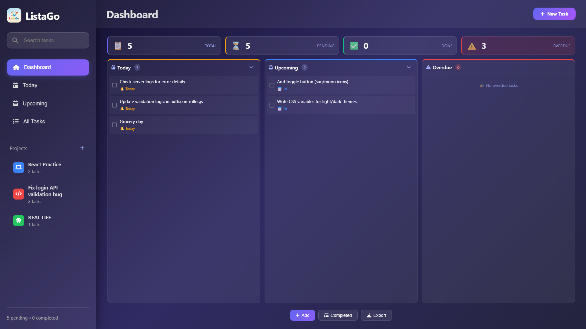

# ListaGo - Modern ToDo List Application with Project Management

A beautiful, feature-rich todo list application with a modern glassmorphism design, built with vanilla JavaScript and ES6 modules. Track your tasks, organize them into projects, and manage deadlines with a comprehensive dashboard.



## ✨ Features

### 🎯 Core Functionality
- **Add Tasks**: Quickly add new tasks with Enter key or button click
- **Complete Tasks**: Check/uncheck tasks with smooth animations
- **Edit Tasks**: Inline editing with modal dialog
- **Delete Tasks**: Safe deletion with confirmation modal
- **Filter Tasks**: View All, Active, or Completed tasks
- **Due Dates**: Assign dates to tasks and track overdue items
- **Persistent Storage**: Tasks and projects saved in browser's localStorage
- **Search Tasks**: Real-time search across all your tasks

### 📁 Project Management
- **Create Projects**: Organize tasks into custom projects
- **Custom Icons & Colors**: Choose from a variety of icons and colors for each project
- **Project Filtering**: View tasks by specific project
- **Default Inbox**: Catch-all project for uncategorized tasks
- **Project Deletion**: Safe project removal with automatic task migration to Inbox

### 📊 Dashboard & Views
- **Dashboard**: Overview with statistics and task sections (Today, Upcoming, Overdue)
- **Today View**: See all tasks due today
- **Upcoming View**: Track tasks due in the next 7 days
- **All Tasks View**: Complete list of every task
- **Statistics Cards**: Visual metrics for total, pending, completed, and overdue tasks
- **Overdue Tracking**: Automatic highlighting of overdue tasks with pulse animations

### 🎨 Modern Design
- **Glassmorphism UI**: Beautiful frosted glass effect with backdrop blur
- **Gradient Backgrounds**: Stunning purple-blue gradient theme
- **Smooth Animations**: Subtle transitions and hover effects
- **Responsive Design**: Works perfectly on desktop, tablet, and mobile
- **Dark Theme**: Easy on the eyes with carefully chosen colors
- **Font Awesome Icons**: Professional iconography throughout the interface
- **Sidebar Navigation**: Collapsible sidebar with quick access to all views

### 🎨 Modern Design
- **Glassmorphism UI**: Beautiful frosted glass effect with backdrop blur
- **Gradient Backgrounds**: Stunning purple-blue gradient theme
- **Smooth Animations**: Subtle transitions and hover effects
- **Responsive Design**: Works perfectly on desktop, tablet, and mobile
- **Dark Theme**: Easy on the eyes with carefully chosen colors

### ⌨️ Keyboard Shortcuts
- `Ctrl/Cmd + A` - Focus input field
- `Delete` - Clear all completed tasks (with confirmation)
- `Escape` - Reset filter to "All"
- `Enter` - Add task (when input is focused)
- `/` - Focus search bar from anywhere in the app

### 🛡️ Advanced Features
- **XSS Protection**: All user input is properly escaped
- **Input Validation**: Maximum task length of 200 characters, project name validation
- **Duplicate Prevention**: Cannot add identical tasks or projects with the same name
- **Error Handling**: Graceful handling of localStorage issues
- **Debouncing**: Prevents accidental double-clicks
- **Multiple Modals**: Delete, edit, and project creation modals with previews
- **UUID Generation**: Unique identifiers for all tasks and projects
- **Date Filtering**: Intelligent filtering of tasks by due date
- **Search Indexing**: Real-time search across all task content
- **Project Migration**: Automatic task migration when projects are deleted

## 🚀 Quick Start

1. **Clone or Download** the project files
2. **Open** `index.html` in your web browser
3. **Start Adding Tasks** - no setup required!

## 📁 Project Structure

```
listaGo/
├── index.html              # Main HTML file
├── modal-test.html         # Modal testing page
├── assets/                 # Assets directory
│   ├── favicon/            # Favicon files
│   │   ├── favicon.ico
│   │   ├── apple-touch-icon.png
│   │   ├── site.webmanifest
│   │   └── ...
│   ├── icon/               # App icon
│   │   └── icon.jpeg
│   └── screenshots/        # Screenshot files
│       ├── default.png
│       ├── addtask.png
│       └── deletemodal.png
├── css/
│   ├── style.css           # Main styling with glassmorphism design
│   ├── modal.css           # All modal styles
│   └── dashboard.css       # Dashboard-specific styling
├── js/
│   ├── app.js              # Main application entry point
│   ├── script-backup.js    # Legacy backup script
│   └── modules/
│       ├── storage.js              # localStorage operations
│       ├── taskManager.js          # Task CRUD operations (with due dates)
│       ├── projectManager.js       # Project management functionality
│       ├── uiRenderer.js           # UI rendering functions
│       ├── sidebar.js              # Sidebar navigation and view switching
│       ├── notifications.js        # Toast notifications
│       ├── modal.js                # Delete confirmation modal
│       ├── editModal.js            # Edit task modal
│       ├── projectModal.js         # Project creation modal
│       ├── utils.js                # Helper functions
│       └── views/
│           └── dashboardView.js     # Dashboard view rendering
├── LICENSE                # MIT License
├── README.md              # This file
└── .gitignore             # Git ignore file
```

## 🎨 Design System

### Colors
- **Primary**: `#6366f1` (Indigo) to `#8b5cf6` (Purple) gradient
- **Background**: Dark purple-blue gradient (`#0f0c29` to `#24243e`)
- **Glass Effect**: `rgba(255, 255, 255, 0.08)` with `backdrop-filter: blur(20px)`
- **Text**: Light gray (`#e0e0e0`) for optimal readability

### Typography
- **Font**: Inter (system-ui stack) for modern, clean text
- **Sizes**: Responsive scaling from 0.8rem to 1.8rem
- **Weights**: 400 (normal), 600 (semibold), 700 (bold)

### Animations
- **Task Entry**: Slide-in with scale animation
- **Hover Effects**: Subtle lift and shadow
- **Notifications**: Slide from right with fade
- **Modal**: Smooth fade-in overlay

## 💻 Technical Details

### Architecture
- **ES6 Modules**: Clean separation of concerns
- **Event Delegation**: Efficient event handling
- **State Management**: Centralized task state
- **No Dependencies**: Pure vanilla JavaScript

### Browser Support
- ✅ Chrome 80+
- ✅ Firefox 75+
- ✅ Safari 13+
- ✅ Edge 80+
- ✅ Mobile browsers

### Performance
- **Lazy Loading**: Modules loaded on demand
- **Debouncing**: Prevents excessive function calls
- **Efficient DOM Updates**: Minimal re-renders
- **Local Storage**: Fast client-side persistence
- **Responsive Grid Layouts**: CSS Grid for efficient space utilization

### Data Models

**Task Object**
```javascript
{
  id: "uuid-string",
  text: "Task description",
  completed: false,
  createdAt: "ISO-date-string",
  dueDate: "YYYY-MM-DD" || null,
  projectId: "project-uuid" || null
}
```

**Project Object**
```javascript
{
  id: "uuid-string",
  name: "Project Name",
  color: "#hex-color",
  icon: "fas fa-icon-name",
  createdAt: "ISO-date-string"
}
```

## 🔧 Customization

### Changing Colors
Edit the CSS variables in [`style.css`](css/style.css):

```css
:root {
  --primary-gradient: linear-gradient(135deg, #6366f1 0%, #8b5cf6 100%);
  --bg-gradient: linear-gradient(135deg, #0f0c29 0%, #302b63 50%, #24243e 100%);
}
```

### Modifying Task Limits
Change the maximum task length in [`taskManager.js`](js/modules/taskManager.js):

```javascript
const MAX_TASK_LENGTH = 200; // Change as needed
```

### Customizing Dashboard Animations
Adjust pulse animation for overdue tasks in [`dashboard.css`](css/dashboard.css):

```css
.stat-card-compact.overdue.has-overdue {
    animation: pulse 2s infinite;
}
```

### Adding More Project Icons
Extend the available project icons in [`projectModal.js`](js/modules/projectModal.js) to add more Font Awesome icons for projects.

### Customizing Project Colors
Add more color options to the project creation modal in the color picker to expand your customization options.

## 🐛 Troubleshooting

### Tasks Not Saving
- Check if localStorage is enabled in your browser
- Ensure you're not in private/incognito mode
- Try clearing browser data and reloading

### Projects Not Loading
- Clear browser cache and refresh
- Check browser console for JSON parsing errors
- Ensure localStorage has sufficient space available

### Dashboard Not Rendering
- Check if you have JavaScript enabled
- Verify all module files are present in the correct directories
- Check browser console for module loading errors

### Search Not Working
- Refresh the page to reset the search functionality
- Clear any browser extensions that might interfere with input events

### Buttons Not Working
- Refresh the page (F5)
- Check browser console for errors
- Ensure JavaScript is enabled

### Mobile Issues
- Try rotating your device
- Clear browser cache
- Update to latest browser version
- Verify glassmorphism effects are supported on your mobile browser

## 🤝 Contributing

Feel free to:
- Report bugs
- Suggest new features
- Submit pull requests
- Share your customizations

## 📄 License

This project is open source and available under the [MIT License](LICENSE).

## 🙏 Acknowledgments

- Design inspired by modern glassmorphism trends
- Color palette from Tailwind CSS
- Icons from emoji set
- Built with love and vanilla JavaScript

---

**Made with ❤️ for productivity enthusiasts**